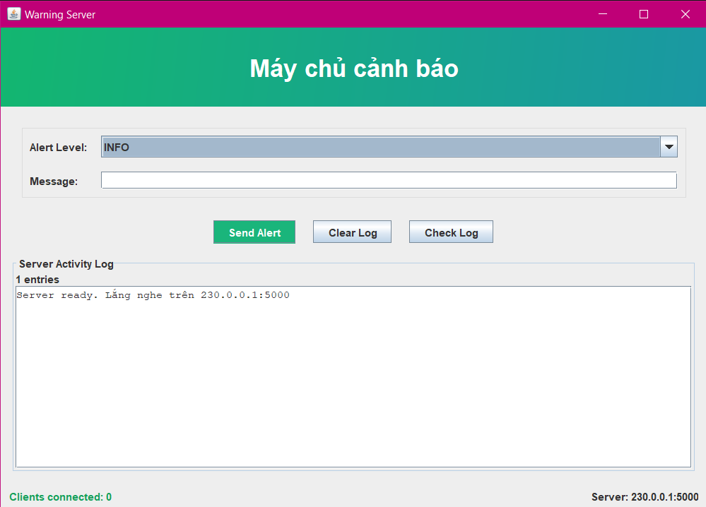
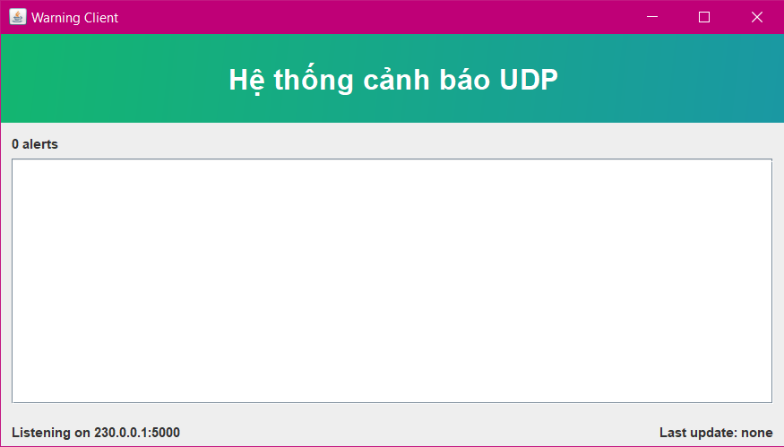
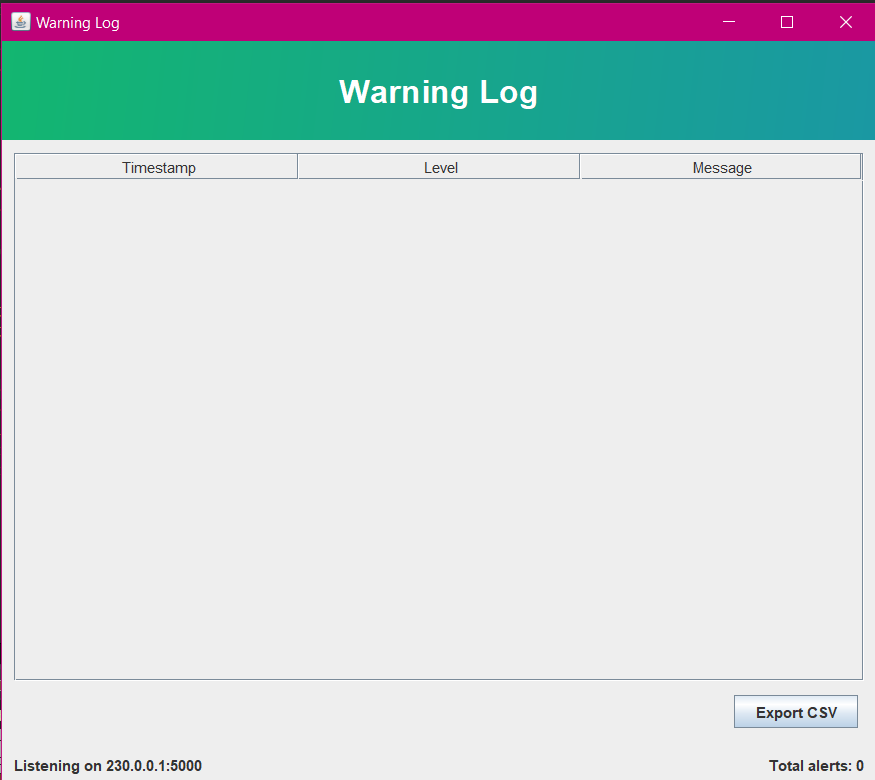

<h2 align="center">
    <a href="https://dainam.edu.vn/vi/khoa-cong-nghe-thong-tin">
    🎓 Faculty of Information Technology (DaiNam University)
    </a>
</h2>
<h2 align="center">
   HỆ THỐNG CẢNH BÁO THỜI GIAN THỰC
</h2>
<div align="center">
    <p align="center">
        
        
        
    </p>

[](https://www.facebook.com/DNUAIoTLab)
[](https://dainam.edu.vn/vi/khoa-cong-nghe-thong-tin)
[](https://dainam.edu.vn)

</div>

---
## 1. Giới thiệu hệ thống
Hệ thống cảnh báo sử dụng **UDP multicast** được thiết kế nhằm mô phỏng mô hình truyền thông tin cảnh báo trong mạng.  
Mục tiêu chính:
- Cho phép nhiều **Client** cùng tham gia vào nhóm multicast để gửi dữ liệu (cảnh báo hoặc heartbeat) đến **Server**.
- **Server** có nhiệm vụ lắng nghe gói tin từ các client, phân biệt giữa cảnh báo và heartbeat.
- **Logger** hỗ trợ ghi lại các sự kiện cảnh báo quan trọng, loại bỏ gói heartbeat để không gây nhiễu log.

### Chức năng chính
**Client:**
  - Nhận gói cảnh báo thủ công khi có sự kiện xảy ra.
  - Gửi gói heartbeat tự động theo chu kỳ (mặc định 10s/lần) để báo hiệu client vẫn còn hoạt động.

**Server:**
  - Nhận gói tin từ client thông qua multicast group.
  - Hiển thị thông tin gói tin trên giao diện.

**Log:**
  - Ghi lại các sự kiện cảnh báo vào file log.

### Ý nghĩa của hệ thống
- Giúp làm quen với **lập trình mạng (socket, UDP, multicast)**.  
- Minh họa cách xây dựng một hệ thống **giám sát phân tán**.  
- Có thể mở rộng áp dụng vào các hệ thống cảnh báo trong **IoT, giám sát hạ tầng, quản lý mạng nội bộ**.  

---
## 2. Công nghệ sử dụng
<div align="center">
    
[](https://www.oracle.com/java/)
[](https://en.wikipedia.org/wiki/User_Datagram_Protocol)
[](https://viblo.asia/p/java-sockets-WAyK8x7kKxX)
[](https://docs.oracle.com/javase/tutorial/uiswing/)

</div>

---
## 3. Một số hình ảnh hệ thống
### Giao diện Server


### Giao diện Client


### Giao diện Logger


---
## 4. Các bước cài đặt 

🛠️ **4.1. Yêu cầu hệ thống**

☕ **Java Development Kit (JDK):** Phiên bản 8+ (khuyến nghị JDK 11 hoặc 17)  
💻 **Hệ điều hành:** Windows, macOS, hoặc Linux  
🖥️ **Môi trường phát triển:** IDE (IntelliJ IDEA, Eclipse, NetBeans) hoặc terminal  
📡 **Kết nối mạng:** LAN hoặc Internet nếu muốn nhiều client cùng kết nối  
💾 **Bộ nhớ:** ≥ 4GB RAM, dung lượng trống tối thiểu 500MB  

---

📥 **4.2. Các bước cài đặt**

### 🧰 Bước 1: Chuẩn bị môi trường
Cài đặt **Java JDK** (yêu cầu JDK 8 trở lên, JDK 21 vẫn chạy tốt).  
Kiểm tra bằng lệnh:  
  ```bash
  java -version
  javac -version
  ```
Nếu cả hai hiển thị version ≥ 8 là hợp lệ.
Cấu trúc thư mục dự án:
```
└── src/
    ├── client/   # Code giao diện & xử lý phía Client
    ├── server/   # Code xử lý Server
    ├── logger/   # Code ghi log cảnh báo
```
### 🏗 Bước 2: Biên dịch mã nguồn
Mở terminal và điều hướng đến thư mục src của dự án:
```
cd path/to/project/src
javac server/Server.java client/Client.java logger/Logger.java
```
### ▶️ Bước 3: Chạy ứng dụng
Khởi động Server
```
java server.Server
```
Server sẽ lắng nghe trên multicast group mặc định 230.0.0.1:5000.
Console hiển thị:
```
[Server] Listening on multicast group 230.0.0.1:5000
```
Khởi động Client
```
java client.Client
```
Mỗi client có thể mở trên 1 terminal hoặc nhiều cửa sổ IDE.
Khi vào, nhập Client ID và bắt đầu gửi Heartbeat/Cảnh báo.
Khởi động Logger
```
java logger.Logger
```
Logger sẽ chỉ ghi cảnh báo vào file logger.log và hiển thị real-time trên GUI.

### 🚀 Cách sử dụng

- Client tự động gửi heartbeat mỗi 10s.
- Người dùng có thể gửi cảnh báo tùy chỉnh từ giao diện Client.
- Server phân biệt cảnh báo và heartbeat, sau đó hiển thị trên GUI.
- Logger chỉ ghi nhận cảnh báo để lưu trữ lịch sử.


---
## 5. Liên hệ
- **Sinh viên thực hiện:** **Lã Việt Hoàng**
- **Khoa Công nghệ thông tin – Đại học Đại Nam**  
- 🌐 Website: [https://dainam.edu.vn/vi/khoa-cong-nghe-thong-tin](https://dainam.edu.vn/vi/khoa-cong-nghe-thong-tin)  
- 📧 Email: [lahoangprotknl@gmail.com]
- 📱 Fanpage: [AIoTLab - FIT DNU](https://www.facebook.com/DNUAIoTLab)

---
